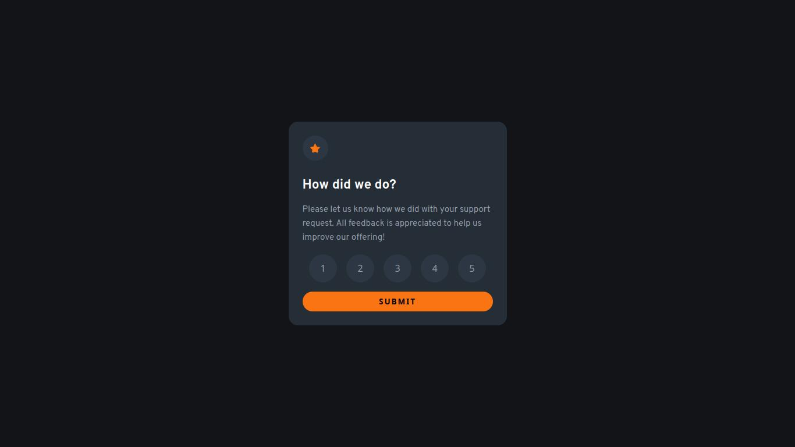

# Frontend Mentor - Interactive rating component solution

This is a solution to the [Interactive rating component challenge on Frontend Mentor](https://www.frontendmentor.io/challenges/interactive-rating-component-koxpeBUmI). Frontend Mentor challenges help you improve your coding skills by building realistic projects. 

## Table of contents

- [Overview](#overview)
  - [The challenge](#the-challenge)
  - [Screenshot](#screenshot)
  - [Links](#links)
- [My process](#my-process)
  - [Built with](#built-with)
  - [What I learned](#what-i-learned)
  - [Continued development](#continued-development)
- [Author](#author)

## Overview

### The challenge

Users should be able to:

- View the optimal layout for the app depending on their device's screen size
- See hover states for all interactive elements on the page
- Select and submit a number rating
- See the "Thank you" card state after submitting a rating

### Screenshot

### Links

- Solution URL: [Github Repo](https://github.com/PedroReves/Rating-Component)
- Live Site URL: [Live Site](https://pedroreves.github.io/Rating-Component/)

## My process

### Built with

- Semantic HTML5 markup
- CSS custom properties
- Flexbox

### What I learned

In this Project i learned more about states and how can i handle them, like how can i interact between pages and so on, it was a good project to mess with javascript a little bit.

### Continued development

I would like to fix some issues in this project later on, i'd like to see more about color transparency and what's the best way to handle them, i kept with the design, but there was some parts that i couldn't do exactly because of the color transparency.

## Author

- Frontend Mentor - [@PedroReves](https://www.frontendmentor.io/profile/PedroReves)

